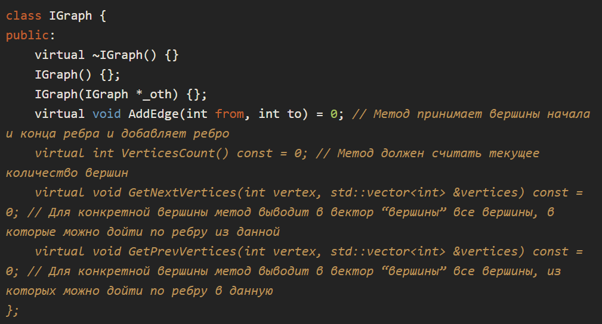

# 31.5 Практическая работа

### Цели практической работы

* Закрепить навыки работы с классами с++
* Разобраться с механикой работы умных указателей с подсчётом ссылок
* Освоить использование перегрузки методов класса

### Что входит в работу

* Реализовать умный указатель.
* Реализовать класс графа.

## Задача 1. Реализация умного указателя

### Что нужно сделать:

Реализуйте умный указатель shared_ptr_toy с распределённым доступом и механикой подсчёта ссылок для класса Toy,
реализованного в задании. Указатель должен иметь все стандартные методы класса и быть функциональной заменой 
использованию shared_ptr<Toy>. Реализуйте свободную функцию make_shared_toy, которая принимает набор аргументов
и конструирует игрушку или от названия, или при помощи копии другой игрушки.

### Рекомендации

Не забудьте в деструкторе умного указателя уменьшить число ссылок на единицу, а когда на счётчике появится значение
ноль, удалить объект.

Можно использовать перегрузки под разные типы, благо их ограниченное количество.

### Чек-лист для проверки задачи

Класс называется shared_ptr_toy.
Реализованы конструктор, конструктор копий, оператор присваивания копированием, деструктор и функция make_shared.

### Что оценивается

Соответствие разработанного типа указателя стандартному типу shared_ptr при использовании с классом Toy.
Корректность логики работы функции создания экземпляра класса.

## Задача 2. Реализация класса графа

### Что нужно сделать:

Прочитайте, что такое графы в дискретной математике, как граф можно представить в программе, что такое матрицы
смежности и списки смежности. Ссылки на источники даны в «Рекомендациях». Вам дан базовый интерфейс для представления
ориентированного графа. Напишите две реализации интерфейса: ListGraph, хранящий граф в виде массива списков смежности.
MatrixGraph, хранящий граф в виде матрицы смежности. Реализуйте конструктор, принимающий IGraph. Такой конструктор
должен скопировать переданный граф в создаваемый объект. Обратите внимание, что иногда в одну реализацию графа 
копируется другая. Реализуйте в том числе все конструкторы копий и операторы присваивания, если это необходимо.

### Рекомендации

Во всех алгоритмах поиска вам потребуются рёбра для вершин. Для этого используйте std::unordered_set и его метод contains.

### Изучите следующую информацию:

* Просто о графах. Попытка популяризации.
* Теория графов. Дискретная математика.
* Представление графа с помощью матриц смежности, инцидентности и списков смежности.
* 

Пример кода:

### Чек-лист для проверки задачи

Реализованы два класса-наследника, имплементирующие корректные алгоритмы работы с графом как с матрицей смежности
и списками смежности.

### Что оценивается

Корректность и совместимость представлений графов двумя разными способами.

